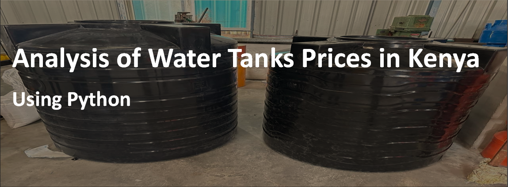

## Technologies:
- Python (Data analysis and visualization)
- Libraries: Pandas (Data manipulation), NumPy (Numerical computing), Matplotlib/Seaborn (Data visualization)

## Table of content 

- [Background](#background)
- [Objective](#objective)
- [Key questions](#key-questions)
- [Data Collection](#data-collection)
- [Data Quality Check](#data-quality-check)
- [Data Analysis](#data-analysis)
- [Interpretation](#interpretation)
- [Recommendations](#recommendations)
- [Conclusion](#conclusion)

### Background: 
In Kenya, water scarcity is a significant challenge, making water storage solutions such as water tanks critical for both residential and commercial use. Various brands offer water tanks of different sizes and prices. However, consumers often face difficulties in selecting the most cost-effective and reliable water tanks due to the wide range of available options.

### Objective:
The objective of this analysis is to understand the pricing patterns of water tanks in Kenya across different brands and sizes. By analyzing the data on water tank prices, sizes, and brands, I aim to provide insights that can help consumers make informed purchasing decisions.

### Key questions: 

1. What is the price range for each brand?
2. How does tank size affect price?
3. Which brand offers the cheapest tanks for a given size?
4. What is the distribution of tank prices by brands and sizes?
5. Is there a significant difference in prices between brands?
6. What is the average price of water tanks by brand?
7. What are the most and least expensive brands on average?
8. Which brand offers the best value for money based on price per litre?
--------
### Data collection

I shall apply [web scrapping](Assets/web_scrape.ipynb) method using **Python** to get the data from a webpage.

My [dataset](Assets/Water_tank_prices_Kenya.csv) has **3** columns:
 - Size (Litres) - Capacity of the water tank
 - Brand - Manufacturer of the tank
 - Price (Kshs) - Cost of the tank in Kenyan shillings
 

### Data Quality Check 

   #### a. Check for missing values

#### b. Check for duplicates 

#### c. Validate data types 

#### d. Check for logical consistency 
 - Whether higher capacity tanks generally cost more.

 [Here](Assets/Data_Analysis.ipynb) is the code.

---------------

### Data Analysis 

This is the stage where I got the answers to the [8 key questions](#key-questions).

[Here](Assets/Data_Analysis.ipynb) is the code.

### Interpretation 

The correlation of 0.97389948 between size and price of tank indicates a very strong positive relationship. This means that as the size of the water tank increases, the price also increases significantly. Such a high correlation suggests that the size of the tank is a major factor influencing its price.

In the case of checking whether there is a significant difference in prices between brands, the null hypothesis $H_0$ states that there is no difference in the prices between brands while alternative hypothesis $H_1$
 states there is.
  - Since I have gotten a p-value of 0.696163, we fail to reject $H_0$
. This means there is no enough evidence to suggest there are significant differences in prices.

Most expensive brand is Roto tank while the least expensive is Vectus tank.

The brand that offers the best value for money is Vectus tank.

----------
### Recommendations

1. **Compare Prices Across Brands**:
   - This helps to quickly identify which brands offer better value for specific tank sizes.

2. **Consider Brand Reputation**:

   - Research Brand Reliability: Choose brands with a reputation for durability and quality. Customer reviews and ratings can be very helpful.
   - Warranty and After-Sales Service: Look for brands that offer good warranty terms and reliable after-sales service

3. **Identify Your Needs**:

   - Determine the Right Size: Calculate the water storage capacity you need based on your household or business requirements. Larger tanks might be more cost-effective in the long run if you have high water usage.
   - Space Availability: Ensure you have enough space for the size of the tank you are considering.

4. **Check for Deals and Discounts**:

   - Seasonal Promotions: Look out for seasonal promotions. Some brands might offer discounts during certain times of the year.
   - Bulk Purchase Discounts: If you need multiple tanks, check if there are discounts for bulk purchases.

5. **Consider Long-Term Costs**:

   - Maintenance and Repairs: Sometimes, a slightly more expensive tank with lower maintenance costs can be more economical in the long run.
   - Operational Efficiency: Some tanks might have features that save water or are more energy-efficient, reducing operational costs.
  
6. **Seek Expert Advice**:

   - Consult with Professionals: If you are unsure about the best option, consult with a water management professional or a supplier to get personalized advice based on your specific needs.
   
### Conclusion
This analysis was aiming to shed light on the pricing dynamics of water tanks in Kenya, helping consumers choose the best options based on their needs and budgets.

