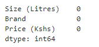
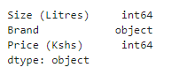
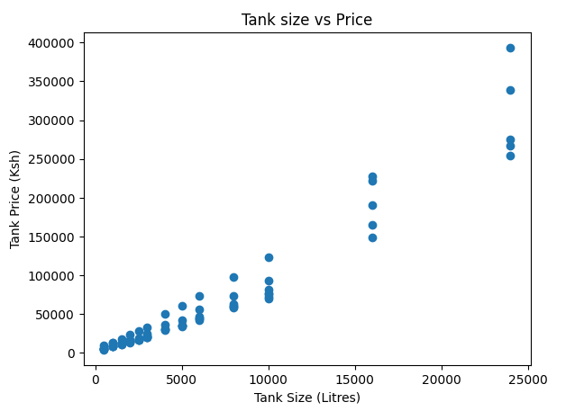

# Analysis of Water Tank Prices in Kenya 

## Background: 
In Kenya, water scarcity is a significant challenge, making water storage solutions such as water tanks critical for both residential and commercial use. Various brands offer water tanks of different sizes and prices. However, consumers often face difficulties in selecting the most cost-effective and reliable water tanks due to the wide range of available options.

## Objective:
The objective of this analysis is to understand the pricing patterns of water tanks in Kenya across different brands and sizes. By analyzing the data on water tank prices, sizes, and brands, I aim to provide insights that can help consumers make informed purchasing decisions.

## Key questions: 

1. What is the price range for each brand?
2. How does tank size affect price?
3. Which brand offers the cheapest tanks for a given size?
4. What is the distribution of tank sizes?
5. Is there a significant difference in prices between brands?
6. What is the average price of water tanks by brand?
7. What are the most and least expensive brands on average?
8. Which brand offers the best value for money based on price per liter?

## Data collection

I shall apply web scrapping method using **Python** to get the data from a webpage.

```python
import requests
from bs4 import BeautifulSoup
import pandas as pd

#URL of the page to scrape
url = ''

#Send a GET request to the page
response = requests. get(url)

#Parse the page content
soup = BeautifulSoup(response.content,'html.parser')

#Find the table in the page assuming the table is in a apecific class or id
table = soup.find ('table')

#Initialize lists to store the data
sizes = []
brands = []
prices = []

#Extract table rows
rows = table. find_all('tr')
for row in rows[1:]: #skip the header row
    cells = row.find_all('td')
    if len(cells) == 3:
        size = cells [0].text.strip ()
        brand = cells [1].text.strip()
        price = cells [2].text.strip ()

        sizes.append(size)
        brands.append(brand)
        prices.append(price)

#Create a DataFrame
data = {
'Size (Litres)' : sizes,
'Brand' : brands,
'Prices (Kshs)' : prices
}
df = pd.DataFrame(data)

#Optionally, save the DataFrame to a csv file
df.to_csv('Water_tank_prices_Kenya. csv', index = False)
```

## Data Quality Check 

After saving the DataFrame as CSV file, I later load the data: 

```python
import pandas as pd

Tanks = pd.read_csv(r'file_path')
``` 

### a. Check for missing values

```python
Tanks.isnull().sum()
```


### b. Check for duplicates 

```python
Tanks.duplicated().sum()
```
 

### c. Validate data types 

```python
Tanks.dtypes
```


### d. Check for logical consistency 
Whether higher capacity tanks generally cost more.

```python
import matplotlib.pyplot as plt
plt.scatter(Tanks['Size (Litres)'], Tanks['Price (Kshs)'])
plt.xlabel('Tank Size (Litres)')
plt.ylabel('Tank Price (Kshs)')
plt.title('Tank size vs Price')
plt.show()
```



It's evident that as tank size increase, the price also increases for each brand.

---------------

I now have a [dataset]() containing **109** rows and **3** columns ready for analysis.

-------------

## Data Analysis 

Let's answer the questions on board:

1. What is the price range for each brand?

```python
Tanks.groupby('Brand')['Price (Kshs)'].agg(['min','max'])
```


2. How does tank size affect price?

```python
correlation = Tanks['Size (Litres)'].corr(Tanks['Price (Kshs)'])
print(f'The correlation between size and price is {correlation}')
```


3. Which brand offers the cheapest tanks for a given size?

```python
def cheapest_brand_for_size(size):
    filtered_Tanks = Tanks[Tanks['Size (Litres)'] == size]
    cheapest_tank = filtered_Tanks.loc[filtered_Tanks['Price (Kshs)'].idxmin()]
    return cheapest_tank['Brand'], cheapest_tank['Price (Kshs)']

brand, price = cheapest_brand_for_size(24000) #input any value of the size to get the cheapest brand and at what cost
print(f'The cheapest brand is {brand} with a price of Kshs {price}')
```


4. What is the distribution of tank prices by brands and sizes?

```python
#plotting the clustered column chart
import seaborn as sns

#define a color palette for diff sizes
palette = {
    500: '#1f77b4',   # Blue
    1000: '#ff7f0e',  # Orange
    1500: '#2ca02c',  # Green
    2000: '#d62728',  # Red
    2500: '#9467bd',  # Purple
    3000: '#8c564b',  # Brown
    4000: '#e377c2',  # Pink
    5000: '#7f7f7f',  # Gray
    6000: '#bcbd22',  # Olive
    8000: '#17becf',  # Cyan
    10000: '#1f77b4', # Light Blue
    16000: '#ff7f0e', # Light Orange
    24000: '#2ca02c'  # Light Green
}
plt.figure(figsize=(14,8))
sns.barplot(x='Brand',y='Price (Kshs),hue='Size (Litres)',data=Tanks,palette=palette,errorbar=None)

#adding labels and title
plt.xlabel('Brands')
plt.ylabel('Price (Kshs)')
plt.title('Water Tank Prices by Brand and Size')
plt.legend(title='Tank size')

#rotating x axis labels for better readability
plt.xticks(rotation = 45)
plt.tight_layout()
plt.show()
```


5. Is there a significant difference in prices between brands?

I shall perform an ANOVA test to determine if there are significant differences in prices among brands.

```python
from scipy import stats
brand_prices = [Tanks[Tanks['Brand'] == brand]['Price (Kshs)'] for brand in Tanks['Brands'].unique()]
anova_result = stats.f_oneway(*brand_prices)
anova_result
```
6. What is the average price of water tanks by brand?
```python
average_price_by_brand = Tanks.groupby('Brand')['Price (Kshs)'].mean()
average_price_by_brand
```

7. What are the most and least expensive brands on average?

```python
sorted_avg_price_by_brand = average_price_by_brand.sort_values(ascending=False)
most_expensive_brand = sorted_avg_price_by_brand.index[0]
least_expensive_brand = sorted_avg_price_by_brand.index[-1]
print(f'Most expensive brand on average is {most_expensive_brand}.')
print(f'Least expensive brand on average is {least_expensive_brand}.')
```


8. Which brand offers the best value for money based on price per litre?
```python
Tanks['Price per litre '] = Tanks['Price (Kshs)'] / Tanks['Size (Litres)']
best_value_brand = Tanks.groupby('Brand')['Price per Litre'].mean().idxmin()
print(f'Brand offering the best value for money is {best_value_brand}.')
```

## Interpretation 

The correlation of 0.967868 between size and price of tank indicates a very strong positive relationship. This means that as the size of the water tank increases, the price also increases significantly. Such a high correlation suggests that the size of the tank is a major factor influencing its price.

In the case of checking whether there is a significant difference in prices between brands, the null hypothesis $H_0$ states that there is no difference in the prices between brands while $H_1$
 states there is.
  - Since I have gotten a p-value of 0.704671,we fail to reject \( H_0 \). This means there is no enough evidence to suggest there are significant differences in prices.
